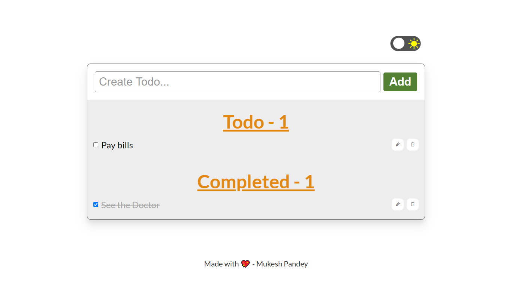
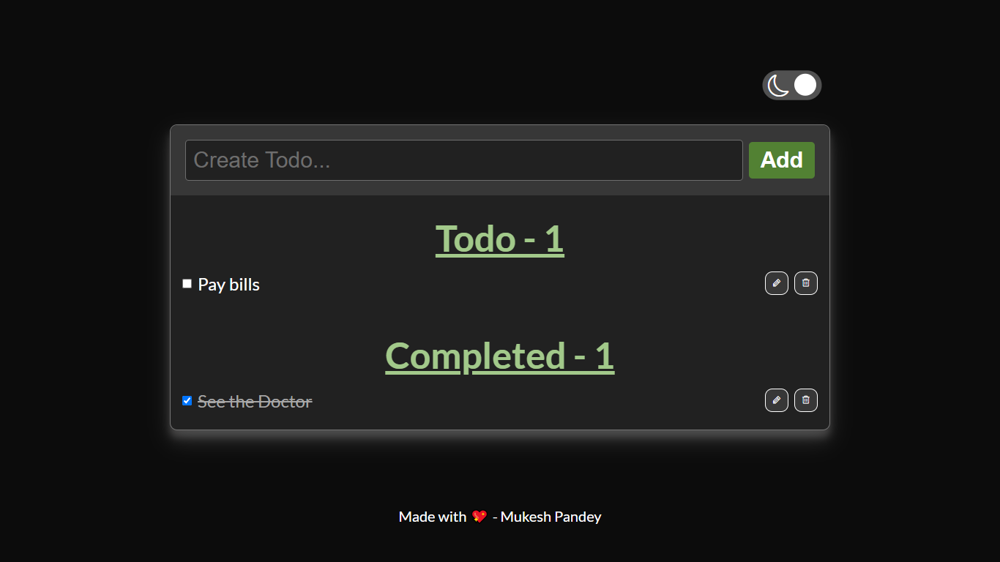

# OCTANET_SEPTEMBER_TASK2

<h1 align="center" id="title">To Do List</h1>

This repository contains the second task (i.e. To Do List) assigned by OctaNet.

<h2>🚀 Demo</h2>

[https://movixzilla.netlify.app/](https://todolistmp.netlify.app/)

<h2>Project Screenshots:</h2>

